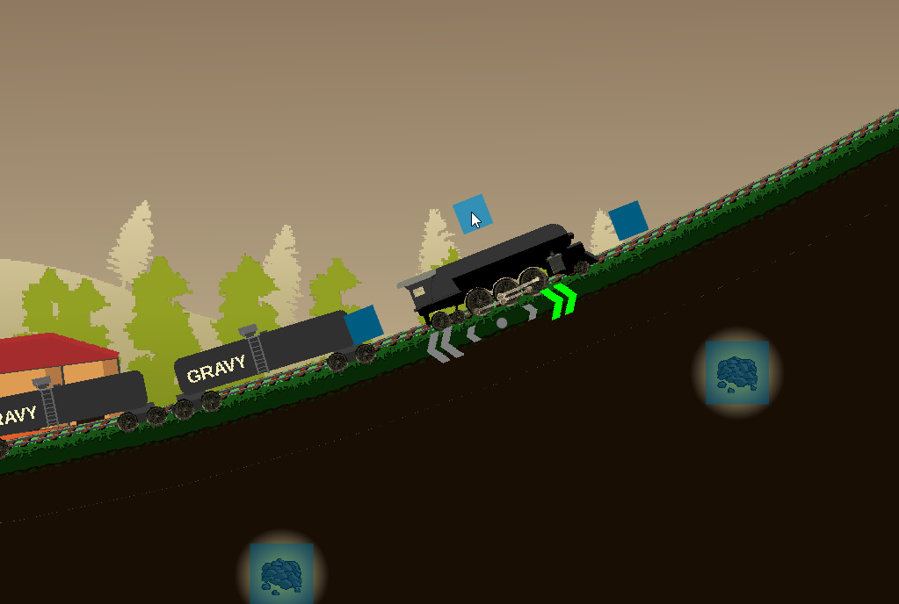

# BCIJam_2021

Game name: Gravy Train

Premise: 
A nearby city has had a complete and utter gravy shortage. You are the conductor of the only train that can save them by bringing them gravy, and become rich in the process.
Pick up gravy tanks and coal to fuel your train, and make it to the city in one piece to win the game.

Controls: 
All controls are mouse clickable and (hopefully) BCI supported. Clickable blinking squares are placed over any world objects that you may want to interact with.

Click the square in front of the train to speed up, and the one behind the train to slow down. 
The square above the train allows you to jump to avoid dangerous rocks.
You can also click on bags of coal and gravy tanker cars to take them with you.

### Attribution for Assets used:

#### Music:
https://opengameart.org/content/sunny-side-up-updated-version
- Alex McCulloch: 
- https://musiccompositionhacks.blogspot.com/2020/07/how-to-improvise-music-in-real-time.html
- https://prosensory.blogspot.com/
License: CC0

#### Sounds: 

train-horn-single and train-horn-double: 
- https://freesound.org/people/jjboeke/sounds/470982/
- License: CC0

chug-chug-low-qual:
- https://freesound.org/people/gadzooks/sounds/39413/
- License: CC0

steam-train-departs: 
- https://freesound.org/people/acclivity/sounds/25719/
- License: CC0

steam-burst:
- https://freesound.org/people/pengo_au/sounds/90143/
- License: CC0

Rock break sound - concrete_break01_SOURCE_UNKNOWN.WAV
- Unknown source, this one must be replaced for any proper release of the game.
- License: unknown

#### CC0 License:
https://creativecommons.org/publicdomain/zero/1.0/
